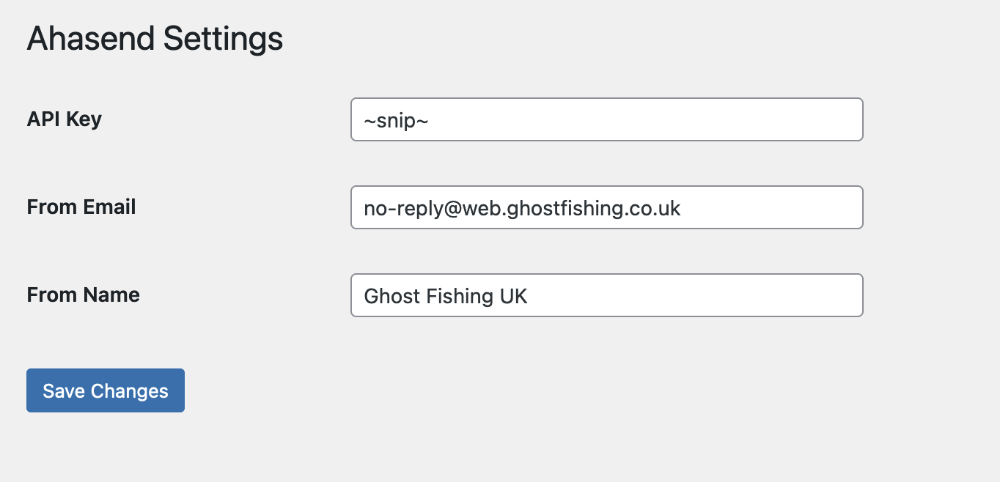

# Wordpress Plugin for sending emails with Aha Send

A quick and fairly dirty plugin for sending emails with Aha Send.

## Installation

Drop the folder in `wp-content/plugins` and activate the plugin.

## Usage

Grab your credentials from Aha Send and add them to the plugin settings page.

That's it! You can now send emails with Aha Send.

## Logging

This plugin will store a log of all emails sent in the database, this is cleared every 30 days.
